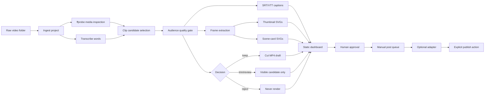

# Video Review OS


Local video clipping infrastructure for creators and small teams.

Drop raw videos into a folder. Video Review OS creates project folders, transcribes the source, finds candidate clips, scores clip quality, cuts MP4 drafts, writes caption files, pulls frame stills, makes thumbnail and scene-card SVG drafts, prepares copy, builds a static review dashboard, and can prepare an approved manual post queue.

The default is still review-only. It does not publish automatically, does not connect social accounts by default, and does not move files into handoff folders unless you explicitly build that workflow around it.

## What It Does

Video Review OS is for the first-pass review work that happens before a clip becomes public:

- Ingest raw videos from a local watch folder.
- Inspect media with `ffprobe`.
- Transcribe with local Whisper, faster-whisper, hosted adapters, or deterministic fallback.
- Select candidate clip ranges from transcript and timing data.
- Flag clips that fail from the audience's point of view.
- Cut/render MP4 drafts with `ffmpeg`.
- Write SRT and VTT caption sidecars.
- Optionally burn captions into MP4 renders.
- Extract representative frame stills for each candidate clip.
- Generate thumbnail and vertical scene-card SVG drafts from frames.
- Overlay optional local mascot/logo assets from config.
- Draft hooks, titles, captions, and review notes.
- Build `dashboard.json` and a static `index.html` review dashboard.
- Track local approval state tied to the exact source hash, time range, and transcript text.
- Prepare `post_queue.json` only for clips that are approved and rendered.

## What You Get From One Run

| Output | What it means |
| --- | --- |
| Source project folder | A clean local folder for each raw video. |
| `source.json` | File hash, original path, active path, media metadata, streams, codecs, and safety state. |
| `transcript.json` | Transcript segments and word timestamps when transcription is configured. |
| `clips.json` | Candidate clip ranges with `keep`, `trim`, `review`, or `reject` decisions. |
| `quality_gate` entries | Audience-first flags for context, starts, pacing, endings, and standalone usefulness. |
| `captions/` | SRT and VTT caption sidecars for visible candidates. |
| `captions.json` | Caption manifest with cue counts and source signature. |
| `scenes/` | Frame stills extracted from candidate clip ranges. |
| `scenes.json` | Scene-frame manifest with timestamps and extraction status. |
| `visuals/` | SVG thumbnail drafts and vertical scene-card drafts made from frames. |
| `visuals.json` | Visual draft manifest, including optional mascot/logo usage. |
| `drafts/copy.json` | Hook, title, caption, copy quality notes, and deterministic fallback copy. |
| `renders/` | Optional MP4 drafts for clips allowed by policy. |
| `renders.json` | Render manifest, including whether captions were burned in. |
| `dashboard.json` | Machine-readable review state. |
| `dashboard/index.html` | Static mobile-friendly dashboard for human review. |
| `approvals.json` | Local approval state tied to the exact source clip and time range. |
| `post_queue.json` | Manual post queue for approved rendered clips. Auto-publishing remains disabled. |

## Pipeline


<details>
<summary>Mermaid source</summary>



</details>

## Why It Exists

Hosted clip tools are useful when you want speed, templates, social account connection, and polished editor workflows.

Video Review OS is different. It is a local-first review pipeline for teams that want to inspect every artifact before anything leaves the machine.

It is built around simple files:

- JSON sidecars.
- SRT/VTT captions.
- Extracted JPEG frames.
- SVG visual drafts.
- MP4 render drafts.
- Static dashboard files.

No hidden database is required for the MVP. No source video is deleted.

## How This Compares To Opus Clip And Other Clip Tools

| Tool | Best at | What Video Review OS does differently |
| --- | --- | --- |
| [Opus Clip](https://www.opus.pro/) | Hosted long-video-to-shorts workflows, AI captions, reframing, B-roll, scheduling, and social publishing. | Runs local-first, keeps JSON/SRT/VTT/SVG/MP4 artifacts inspectable, and defaults to no social connection or auto-publish. |
| [Descript](https://www.descript.com/) | Full video and podcast editing, transcription, recording, cleanup, and collaboration. | Does not try to replace a full editor. It creates a review queue, clip candidates, frames, captions, and draft assets before editing or posting. |
| [Riverside Magic Clips](https://riverside.com/magic-clips) | Recording plus AI-generated social clips, captions, and shareable outputs. | Works from ordinary local folders and emphasizes artifact auditability, quality flags, and approval state. |
| [CapCut](https://www.capcut.com/tools/ai-video-editor) | Creative editing, templates, captions, effects, and AI-assisted video creation. | Focuses on review infrastructure: safe cutting, captions, scene frames, visual drafts, and explicit approval before handoff. |
| Manual editing | Maximum human judgment. | Reduces the first-pass review burden while keeping the final decision with a person. |

Use a hosted editor when you want an all-in-one creative suite.

Use Video Review OS when you want a boring local pipeline that shows its work.

## Quality Gate

The quality gate scores clips from the audience's point of view, not just transcript length.

It flags:

- Starts mid-thought.
- Missing context.
- Filler-heavy openings.
- Stammers and restarts.
- Slate or outtake markers such as `cut five`.
- Repeated placeholder or nonsense words.
- Incomplete ranges.
- Awkward silence or long pauses.
- Too-short standalone clips.
- Weak ending words.
- Generic hooks and low-value captions.


## Clip Decisions

| Decision | Meaning | Default render behavior |
| --- | --- | --- |
| `keep` | Strong enough to become a draft. | Renders by default when rendering is requested. |
| `trim` | Promising, but needs edit work. | Visible, captioned, and visualized, but does not render by default. |
| `review` | Unclear; needs a person to inspect it. | Visible, captioned, and visualized, but does not render by default. |
| `reject` | Bad range, outtake, too short, or unsafe to use. | Never renders, never enters the post queue. |

## Captions, Frames, And Visual Drafts

Video Review OS does not stop at transcript text.

For each visible candidate, it can create:

- `captions/<clip_id>.srt`
- `captions/<clip_id>.vtt`
- `scenes/<clip_id>/frame-001.jpg`
- `scenes/<clip_id>/frame-002.jpg`
- `scenes/<clip_id>/frame-003.jpg`
- `visuals/thumbnails/<clip_id>.svg`
- `visuals/scene-cards/<clip_id>.svg`

The visual drafts use extracted frames as the background or scene stack. If `mascot_image_path` or `logo_image_path` is set in config, those local assets are embedded into the generated SVGs. The repository ships with no private brand assets.

## Approval Safety

Approval does not carry forward unless the regenerated draft matches the same:

- Source video hash.
- Clip start time.
- Clip end time.
- Transcript text hash.


Approval is local review state. It is not publishing permission.

## Posting Model

This project can prepare a manual post queue. It does not publish by default.

`post_queue.json` only marks an item ready when:

- The clip is not rejected.
- The clip has a matching local approval.
- The clip has a rendered MP4 draft.

Actual platform posting should live in an explicit adapter that you wire in yourself. That adapter should still require an approval check before sending anything.

## Install

Prerequisites:

- Python 3.11+
- `ffmpeg`
- `ffprobe`

```bash
git clone https://github.com/YOUR-ORG/video-review-os.git
cd video-review-os
python -m venv .venv
. .venv/bin/activate
python -m pip install -e ".[dev]"
```

For local Whisper:

```bash
python -m pip install -e ".[whisper]"
```

For faster-whisper:

```bash
python -m pip install -e ".[faster-whisper]"
```

## Quick Start

```bash
video-review-os init-config --path config.toml
mkdir -p raw
cp /path/to/video.mp4 raw/
video-review-os --config config.toml run-once
video-review-os --config config.toml dashboard
```

Open:

```text
dashboard/index.html
```

Render default draft clips:

```bash
video-review-os --config config.toml run-once --render
```

Render with burned captions:

```bash
video-review-os --config config.toml run-once --render --burn-captions
```

Prepare a manual post queue after review and render:

```bash
video-review-os --config config.toml approve projects/sample-video-abc123 clip-001
video-review-os --config config.toml post-queue projects/sample-video-abc123 --platform generic
```

## CLI Commands

```bash
video-review-os init-config --path config.toml
video-review-os --config config.toml scan
video-review-os --config config.toml ingest raw/video.mp4
video-review-os --config config.toml transcribe projects/sample-video-abc123
video-review-os --config config.toml select-clips projects/sample-video-abc123
video-review-os --config config.toml draft-copy projects/sample-video-abc123
video-review-os --config config.toml captions projects/sample-video-abc123
video-review-os --config config.toml scenes projects/sample-video-abc123
video-review-os --config config.toml visuals projects/sample-video-abc123
video-review-os --config config.toml render projects/sample-video-abc123
video-review-os --config config.toml render projects/sample-video-abc123 --burn-captions
video-review-os --config config.toml render projects/sample-video-abc123 --include trim
video-review-os --config config.toml approve projects/sample-video-abc123 clip-001 --reviewer "local-reviewer"
video-review-os --config config.toml post-queue projects/sample-video-abc123 --platform generic
video-review-os --config config.toml dashboard
video-review-os --config config.toml run-once
video-review-os --config config.toml watch --interval 60
```

## Configuration

`config.toml`:

```toml
[paths]
watch_dir = "./raw"
projects_dir = "./projects"
dashboard_dir = "./dashboard"

[media]
ffmpeg_path = "ffmpeg"
ffprobe_path = "ffprobe"
copy_source_to_project = false

[transcription]
provider = "fallback" # fallback, whisper, faster-whisper, generic-http
model = "base"
language = ""
device = "cpu"
compute_type = "int8"
hosted_endpoint_env = "VIDEO_REVIEW_TRANSCRIBE_ENDPOINT"
hosted_api_key_env = "VIDEO_REVIEW_TRANSCRIBE_API_KEY"

[quality_gate]
keep_threshold = 80
trim_threshold = 65
review_threshold = 45
min_clip_seconds = 12.0
ideal_min_seconds = 18.0
max_clip_seconds = 90.0
awkward_pause_seconds = 2.2
opening_word_window = 8

[copy]
provider = "fallback" # fallback, generic-http
hosted_endpoint_env = "VIDEO_REVIEW_COPY_ENDPOINT"
hosted_api_key_env = "VIDEO_REVIEW_COPY_API_KEY"

[captions]
max_chars = 42
max_seconds = 3.5
include_decisions = ["keep", "trim", "review"]

[scenes]
frames_per_clip = 3
image_extension = "jpg"
include_decisions = ["keep", "trim", "review"]

[visuals]
thumbnail_width = 1280
thumbnail_height = 720
scene_card_width = 1080
scene_card_height = 1920
brand_accent = "#2563eb"
background = "#111827"
text_color = "#ffffff"
mascot_image_path = ""
logo_image_path = ""
include_decisions = ["keep", "trim", "review"]

[render]
video_codec = "libx264"
audio_codec = "aac"
preset = "veryfast"
crf = 23
default_decisions = ["keep"]
```

## Project Structure

```text
src/video_review_os/
  ingest.py
  transcribe.py
  quality_gate.py
  clip_select.py
  captions.py
  scenes.py
  visuals.py
  render.py
  copy.py
  dashboard.py
  approval.py
  posting.py
  cli.py
tests/
examples/
docs/diagrams/
```

## Artifact Examples

`visuals.json`:

```json
{
  "schema_version": "video_review_os.visuals.v1",
  "project_id": "sample-video-abc123",
  "source_sha256": "abc123...",
  "outputs": {
    "thumbnails_dir": "projects/sample-video-abc123/visuals/thumbnails",
    "scene_cards_dir": "projects/sample-video-abc123/visuals/scene-cards"
  },
  "visuals": [
    {
      "clip_id": "clip-001",
      "decision": "keep",
      "status": "written",
      "thumbnail_svg": "projects/sample-video-abc123/visuals/thumbnails/clip-001.svg",
      "scene_card_svg": "projects/sample-video-abc123/visuals/scene-cards/clip-001.svg",
      "frame_count": 3,
      "uses_mascot": false,
      "uses_logo": false
    }
  ]
}
```

`post_queue.json`:

```json
{
  "schema_version": "video_review_os.post_queue.v1",
  "platform": "generic",
  "auto_publish_enabled": false,
  "requires_explicit_adapter": true,
  "items": [
    {
      "clip_id": "clip-001",
      "status": "ready_for_manual_post",
      "media_path": "projects/sample-video-abc123/renders/clip-001-keep.mp4",
      "title": "Draft title",
      "caption": "Draft caption"
    }
  ]
}
```

## Testing

```bash
python -m pip install -e ".[dev]"
python -m pytest
```

Manual smoke test:

1. Put one video in `raw/`.
2. Run `video-review-os --config config.toml run-once`.
3. Check the project folder for `source.json`, `transcript.json`, `clips.json`, `captions.json`, `scenes.json`, `visuals.json`, and `drafts/copy.json`.
4. Run `video-review-os --config config.toml render <project> --dry-run`.
5. Run `video-review-os --config config.toml dashboard`.
6. Confirm `dashboard/index.html` shows candidates, frame stills, visual drafts, decisions, and approval state.

## Security And Privacy

- Raw videos stay local unless you configure a hosted adapter.
- Do not put API keys in `config.toml`; use environment variables.
- Treat generated transcripts as sensitive.
- Treat project folders as sensitive because JSON sidecars can contain local file paths and transcript text.
- Mascot and logo assets are local paths in config. Do not commit private assets.
- Review generated copy and visual drafts before using them externally.
- Source videos are never deleted by this tool.

## Non-Goals

- No auto-publishing by default.
- No hidden uploads.
- No automatic social account connection.
- No automatic movement into platform handoff folders.
- No bundled private brand assets, mascots, or deployment assumptions.
- No claim that a `keep` clip is approved for publication.
- No attempt to replace human editorial review.
- No destructive source video cleanup.
