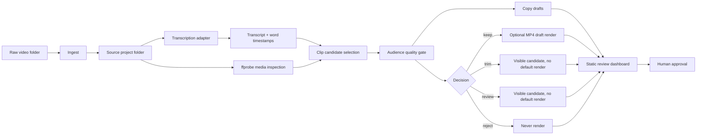
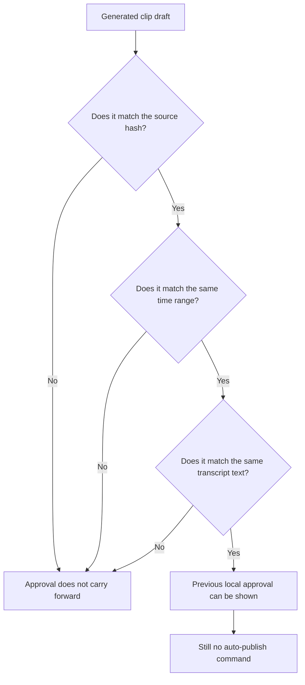
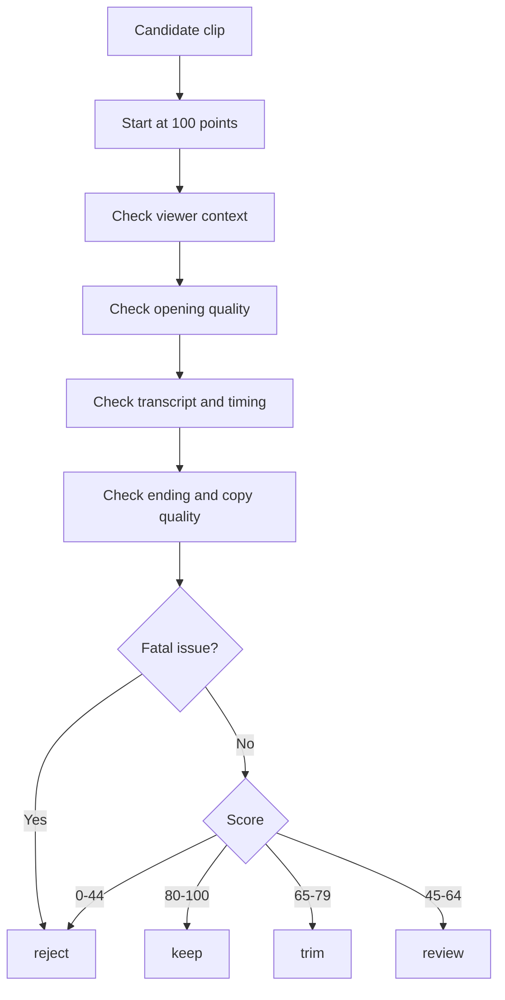

# Video Review OS


Turn raw video folders into reviewable clip drafts without giving automation permission to publish.

Video Review OS is a local-first Python pipeline for creators, agencies, and small teams that record more video than they can review. Drop raw files into a folder and get organized project folders, transcripts, clip candidates, quality reports, captions, titles, optional MP4 drafts, and a simple review dashboard.

The important part: it stops before publishing. A person stays in the approval path.

## The Short Version

Raw footage goes in. Reviewable drafts come out.

Video Review OS helps you answer four practical questions:

- What useful clips are hiding in this long recording?
- Which clips are actually understandable to a viewer?
- What needs trimming, context, or rejection?
- What can a human review before anything goes public?

It is built for boring reliability, not autopilot posting.

## What You Get From One Run

| Output | What it means |
| --- | --- |
| Source project folder | A clean folder for each raw video. |
| `source.json` | File hash, media metadata, duration, codecs, and safety state. |
| `transcript.json` | Transcript segments and word timestamps when transcription is configured. |
| `clips.json` | Candidate clip ranges with `keep`, `trim`, `review`, or `reject` decisions. |
| `drafts/copy.json` | Hook, title, caption, and copy quality notes. |
| `renders/` | Optional MP4 drafts for clips allowed by policy. |
| `dashboard.json` | Machine-readable review state. |
| `dashboard/index.html` | Static mobile-friendly dashboard for human review. |
| `approvals.json` | Local approval state tied to the exact source clip and time range. |

## The Pipeline



## The Safety Model



Approval is local review state. It is not a publishing permission slip.

## The Decision Gate



The gate is audience-first. It looks for clips that may contain a decent sentence but still fail as standalone content.

## What The Gate Flags

- Starts mid-thought.
- Missing context.
- Filler-heavy openings.
- Stammers and restarts.
- Slate or outtake markers such as `cut five`.
- Repeated placeholder or nonsense words.
- Incomplete video ranges.
- Awkward silence or long pauses.
- Too-short standalone clips.
- Weak ending words.
- Generic hooks and low-value captions.

## Clip Decisions

| Decision | Meaning | Default render behavior |
| --- | --- | --- |
| `keep` | Strong enough to become a draft. | Renders by default when rendering is requested. |
| `trim` | Promising, but needs edit work. | Visible, but does not render by default. |
| `review` | Unclear; needs a person to inspect it. | Visible, but does not render by default. |
| `reject` | Bad range, outtake, too short, or unsafe to use. | Never renders. |

## Core Features

### Local-First Ingest

- Watches or scans a configurable raw video folder.
- Creates deterministic project folders.
- Stores source hash, filename, file size, media duration, streams, codecs, and safety metadata.
- Never deletes source videos.

### Pluggable Transcription

- Works with deterministic fallback when no provider is configured.
- Supports local `openai-whisper`.
- Supports `faster-whisper` for CPU-friendly local transcription.
- Includes a generic hosted HTTP adapter for teams that want an external provider.
- Keeps provider output as JSON sidecars instead of hiding it in a database.

### Draft Copy

Video Review OS creates reviewable:

- Titles.
- Hooks.
- Captions.
- Notes.
- Copy quality flags.

If an LLM or hosted copy provider is not configured, the pipeline still produces deterministic fallback copy so the workflow does not break.

### FFmpeg Rendering

- Uses `ffmpeg` for clip rendering.
- Writes temporary files first, then renames.
- Defaults to `keep` only.
- Allows explicit rendering of `trim` or `review` clips when requested.
- Does not render `reject` clips.

### Static Review Dashboard

The dashboard is just files:

- `dashboard.json`
- `index.html`

It can be opened locally on desktop or mobile. It shows candidates, scores, decisions, flags, transcript snippets, draft copy, and approval status.

## Install

Prerequisites:

- Python 3.11+
- `ffmpeg`
- `ffprobe`

```bash
git clone https://github.com/YOUR-ORG/video-review-os.git
cd video-review-os
python -m venv .venv
. .venv/bin/activate
python -m pip install -e ".[dev]"
```

For local Whisper:

```bash
python -m pip install -e ".[whisper]"
```

For faster-whisper:

```bash
python -m pip install -e ".[faster-whisper]"
```

## Quick Start

```bash
video-review-os init-config --path config.toml
mkdir -p raw
cp /path/to/video.mp4 raw/
video-review-os --config config.toml run-once
video-review-os --config config.toml dashboard
```

Open:

```text
dashboard/index.html
```

Render approved-by-policy drafts:

```bash
video-review-os --config config.toml run-once --render
```

By default, this renders only `keep` clips.

## CLI Commands

```bash
video-review-os init-config --path config.toml
video-review-os --config config.toml scan
video-review-os --config config.toml ingest raw/video.mp4
video-review-os --config config.toml transcribe projects/sample-video-abc123
video-review-os --config config.toml select-clips projects/sample-video-abc123
video-review-os --config config.toml draft-copy projects/sample-video-abc123
video-review-os --config config.toml render projects/sample-video-abc123
video-review-os --config config.toml render projects/sample-video-abc123 --include trim
video-review-os --config config.toml dashboard
video-review-os --config config.toml approve projects/sample-video-abc123 clip-001 --reviewer "local-reviewer"
video-review-os --config config.toml run-once
video-review-os --config config.toml watch --interval 60
```

## Configuration

`config.toml`:

```toml
[paths]
watch_dir = "./raw"
projects_dir = "./projects"
dashboard_dir = "./dashboard"

[media]
ffmpeg_path = "ffmpeg"
ffprobe_path = "ffprobe"
copy_source_to_project = false

[transcription]
provider = "fallback" # fallback, whisper, faster-whisper, generic-http
model = "base"
language = ""
device = "cpu"
compute_type = "int8"
hosted_endpoint_env = "VIDEO_REVIEW_TRANSCRIBE_ENDPOINT"
hosted_api_key_env = "VIDEO_REVIEW_TRANSCRIBE_API_KEY"

[quality_gate]
keep_threshold = 80
trim_threshold = 65
review_threshold = 45
min_clip_seconds = 12.0
ideal_min_seconds = 18.0
max_clip_seconds = 90.0
awkward_pause_seconds = 2.2
opening_word_window = 8

[copy]
provider = "fallback" # fallback, generic-http
hosted_endpoint_env = "VIDEO_REVIEW_COPY_ENDPOINT"
hosted_api_key_env = "VIDEO_REVIEW_COPY_API_KEY"

[render]
video_codec = "libx264"
audio_codec = "aac"
preset = "veryfast"
crf = 23
default_decisions = ["keep"]
```

## Project Structure

```text
src/video_review_os/
  ingest.py
  transcribe.py
  quality_gate.py
  clip_select.py
  render.py
  copy.py
  dashboard.py
  approval.py
  cli.py
tests/
examples/
```

## Artifact Examples

`source.json`:

```json
{
  "schema_version": "video_review_os.source.v1",
  "project_id": "sample-video-abc123",
  "source": {
    "original_path": "/videos/raw/sample-video.mp4",
    "active_path": "/videos/raw/sample-video.mp4",
    "sha256": "abc123...",
    "filename": "sample-video.mp4"
  },
  "media": {
    "ok": true,
    "duration_seconds": 320.4,
    "video": { "codec": "h264", "width": 1920, "height": 1080 },
    "audio": { "codec": "aac", "sample_rate": 48000, "channels": 2 }
  },
  "safety": {
    "source_deleted": false,
    "source_moved": false,
    "auto_publish_enabled": false
  }
}
```

`clips.json`:

```json
{
  "schema_version": "video_review_os.clips.v1",
  "project_id": "sample-video-abc123",
  "candidates": [
    {
      "clip_id": "clip-001",
      "start": 14.2,
      "end": 42.8,
      "text": "A complete thought from the transcript.",
      "decision": "keep",
      "quality_gate": {
        "score": 88,
        "decision": "keep",
        "render_allowed_default": true,
        "flags": []
      }
    }
  ],
  "selection_policy": {
    "default_render_decisions": ["keep"],
    "reject_never_renders": true,
    "auto_publish_enabled": false
  }
}
```

## Testing

```bash
python -m pip install -e ".[dev]"
python -m pytest
```

Manual smoke test:

1. Put one video in `raw/`.
2. Run `video-review-os --config config.toml run-once`.
3. Check the project folder for `source.json`, `transcript.json`, `clips.json`, and `drafts/copy.json`.
4. Run `video-review-os --config config.toml render <project> --dry-run`.
5. Run `video-review-os --config config.toml dashboard`.
6. Confirm `dashboard/index.html` shows candidates and decisions.

## Security And Privacy

- Raw videos stay local unless you configure a hosted adapter.
- Do not put API keys in `config.toml`; use environment variables.
- Treat generated transcripts as sensitive.
- Treat project folders as sensitive because JSON sidecars can contain local file paths and transcript text.
- Review generated copy before using it externally.
- Source videos are never deleted by this tool.

## Non-Goals

- No auto-publishing by default.
- No hidden uploads.
- No automatic movement into platform handoff folders.
- No platform account automation.
- No claim that a `keep` clip is approved for publication.
- No attempt to replace human editorial review.
- No destructive source video cleanup.
- No private deployment assumptions.

