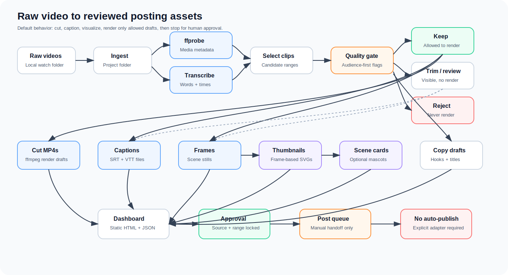
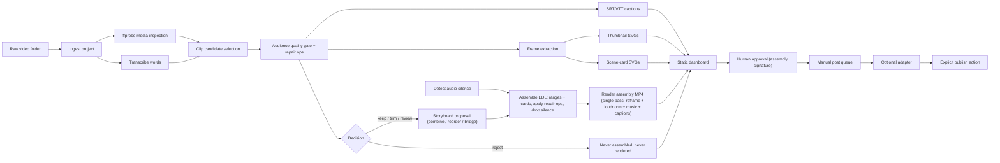
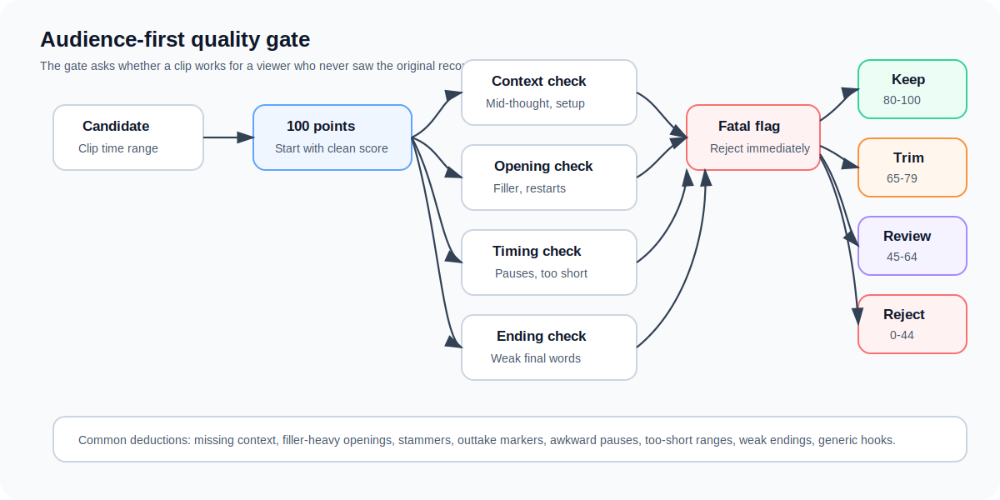
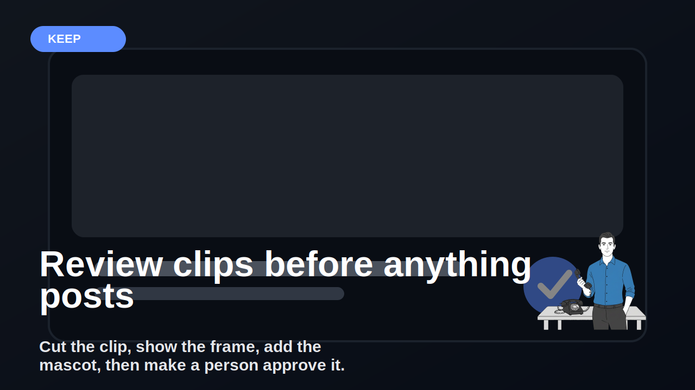
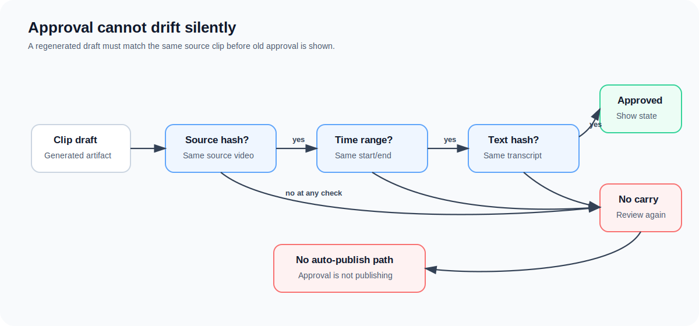

# Video Review OS


Local video clipping infrastructure for creators and small teams.

Drop raw videos into a folder. Video Review OS creates project folders, transcribes the source, finds candidate clips, scores clip quality, **turns the gate's findings into actionable repair ops, assembles finished multi-range edit drafts (trim filler, drop dead air, combine moments, add bridge/title cards), and renders them to MP4**, writes caption files, pulls frame stills, makes thumbnail and scene-card SVG drafts, prepares copy, builds a static review dashboard, and can prepare an approved manual post queue.

It does not just sort clips into keep/reject. It repairs and assembles them into watchable drafts automatically — then waits for a human.

The default is still review-only. It does not publish automatically, does not connect social accounts by default, and does not move files into handoff folders unless you explicitly build that workflow around it. Reject clips are never assembled, never rendered, and never queued.

## What It Does

Video Review OS is for the first-pass review work that happens before a clip becomes public:

- Ingest raw videos from a local watch folder.
- Inspect media with `ffprobe`.
- Transcribe with local Whisper, faster-whisper, hosted adapters, or deterministic fallback.
- Select candidate clip ranges from transcript and timing data.
- Flag clips that fail from the audience's point of view, and emit deterministic **repair ops** (trim the weak ending, drop the awkward pause, cut the filler opening) instead of only flags.
- **Propose a storyboard** (deterministic fallback, or your own LLM endpoint) that can combine, reorder, and bridge clips into finished assemblies.
- **Resolve assemblies into a concrete edit decision list (EDL)** of source ranges plus title/bridge cards, applying the repair ops.
- Cut/render MP4 drafts with `ffmpeg`, including **multi-range assemblies stitched from several source ranges plus generated cards**.
- Write SRT and VTT caption sidecars.
- Optionally burn captions into MP4 renders.
- Extract representative frame stills for each candidate clip.
- Generate thumbnail and vertical scene-card SVG drafts from frames.
- Overlay optional local mascot/logo assets from config.
- Draft hooks, titles, captions, and review notes.
- Build `dashboard.json` and a static `index.html` review dashboard.
- Track local approval state tied to the exact source hash, time range, and transcript text.
- Prepare `post_queue.json` only for clips that are approved and rendered.

## What You Get From One Run

| Output | What it means |
| --- | --- |
| Source project folder | A clean local folder for each raw video. |
| `source.json` | File hash, original path, active path, media metadata, streams, codecs, and safety state. |
| `transcript.json` | Transcript segments and word timestamps when transcription is configured. |
| `clips.json` | Candidate clip ranges with `keep`, `trim`, `review`, or `reject` decisions. |
| `quality_gate` entries | Audience-first flags plus `repair_ops` (actionable trim/drop/lead-in instructions) for each candidate. |
| `silence.json` | Detected audio dead-air intervals (`silencedetect`) the assembly layer drops. |
| `storyboard.json` | Proposal for how candidates become assemblies: members, order, bridge/title cards, rationale. |
| `assemblies.json` | Finished edit decision lists (EDLs): ordered source ranges + cards, applied/unresolved ops, signature. Reject clips never appear. |
| `assembly_renders.json` | Render manifest for the auto-generated assembly MP4 drafts. |
| `assembly_captions.json` + `captions/assemblies/` | Full-timeline SRT/VTT for each assembly, plus per-segment SRTs burned into renders. |
| `assembly_post_queue.json` | Manual post queue for approved, rendered assemblies. Auto-publishing remains disabled. |
| `captions/` | SRT and VTT caption sidecars for visible candidates. |
| `captions.json` | Caption manifest with cue counts and source signature. |
| `scenes/` | Frame stills extracted from candidate clip ranges. |
| `scenes.json` | Scene-frame manifest with timestamps and extraction status. |
| `visuals/` | SVG thumbnail drafts and vertical scene-card drafts made from frames. |
| `visuals.json` | Visual draft manifest, including optional mascot/logo usage. |
| `drafts/copy.json` | Hook, title, caption, copy quality notes, and deterministic fallback copy. |
| `renders/` | Optional MP4 drafts for clips allowed by policy. |
| `renders.json` | Render manifest, including whether captions were burned in. |
| `dashboard.json` | Machine-readable review state. |
| `dashboard/index.html` | Static mobile-friendly dashboard for human review. |
| `approvals.json` | Local approval state tied to the exact source clip and time range. |
| `post_queue.json` | Manual post queue for approved rendered clips. Auto-publishing remains disabled. |

## Pipeline



<details>
<summary>Mermaid source</summary>



</details>

## Why It Exists

Hosted clip tools are useful when you want speed, templates, social account connection, and polished editor workflows.

Video Review OS is different. It is a local-first review pipeline for teams that want to inspect every artifact before anything leaves the machine.

It is built around simple files:

- JSON sidecars.
- SRT/VTT captions.
- Extracted JPEG frames.
- SVG visual drafts.
- MP4 render drafts.
- Static dashboard files.

No hidden database is required for the MVP. No source video is deleted.

## How This Compares To Opus Clip And Other Clip Tools

| Tool | Best at | What Video Review OS does differently |
| --- | --- | --- |
| [Opus Clip](https://www.opus.pro/) | Hosted long-video-to-shorts workflows, AI captions, reframing, B-roll, scheduling, and social publishing. | Runs local-first, keeps JSON/SRT/VTT/SVG/MP4 artifacts inspectable, and defaults to no social connection or auto-publish. |
| [Descript](https://www.descript.com/) | Full video and podcast editing, transcription, recording, cleanup, and collaboration. | Does not try to replace a full editor. It creates a review queue, clip candidates, frames, captions, and draft assets before editing or posting. |
| [Riverside Magic Clips](https://riverside.com/magic-clips) | Recording plus AI-generated social clips, captions, and shareable outputs. | Works from ordinary local folders and emphasizes artifact auditability, quality flags, and approval state. |
| [CapCut](https://www.capcut.com/tools/ai-video-editor) | Creative editing, templates, captions, effects, and AI-assisted video creation. | Focuses on review infrastructure: safe cutting, captions, scene frames, visual drafts, and explicit approval before handoff. |
| Manual editing | Maximum human judgment. | Reduces the first-pass review burden while keeping the final decision with a person. |

Use a hosted editor when you want an all-in-one creative suite.

Use Video Review OS when you want a boring local pipeline that shows its work.

## Quality Gate

The quality gate scores clips from the audience's point of view, not just transcript length.

It flags:

- Starts mid-thought.
- Missing context.
- Filler-heavy openings.
- Stammers and restarts.
- Slate or outtake markers such as `cut five`.
- Repeated placeholder or nonsense words.
- Incomplete ranges.
- Awkward silence or long pauses.
- Too-short standalone clips.
- Weak ending words.
- Generic hooks and low-value captions.



## Clip Decisions

| Decision | Meaning | Default render behavior |
| --- | --- | --- |
| `keep` | Strong enough to become a draft. | Becomes an assembly; renders when rendering is requested. |
| `trim` | Promising, but needs edit work. | Becomes an assembly with its repair ops applied (filler/pause/weak-ending trimmed). |
| `review` | Unclear; needs a person to inspect it. | Becomes an assembly; repair ops applied, but flagged for human attention. |
| `reject` | Bad range, outtake, too short, or unsafe to use. | Never assembled, never renders, never enters the post queue. |

The decision is no longer the end of the story. The quality gate also emits **repair ops** — concrete, deterministic edit instructions derived from the same evidence that produced the flags:

| Repair op | Triggered by | What it does |
| --- | --- | --- |
| `trim_start` | Filler-heavy opening, stammer/restart | Move the in-point past the leading filler or restart. |
| `trim_end` | Weak ending word | Move the out-point before the trailing "and / so / but". |
| `drop_span` | Awkward pause | Split the range to remove the longest dead-air gap. |
| `add_lead_in` | Starts mid-thought, missing context | Suggestion only — needs an adjacent range, so it is left for the storyboard or a person to resolve (never guessed). |

## Storyboards And Assemblies

A clip decision says whether a single range is usable. An **assembly** is the actual deliverable: an ordered edit decision list (EDL) of source ranges and generated cards, with repair ops applied. A plain single-range clip is just a one-segment assembly, so nothing about the simple case changes.

Two layers produce them:

1. **Storyboard** (`storyboard.json`) proposes how candidates become assemblies — which clips to combine, in what order, and where to insert title/bridge cards. The default `fallback` provider is deterministic (one assembly per non-reject clip). Point `provider = "generic-http"` at your own LLM endpoint to combine, reorder, and bridge moments into a stronger narrative. The hosted output is sanitized: a provider can never smuggle in a rejected or non-existent clip.
2. **Assembly** (`assemblies.json`) resolves the proposal into a concrete EDL, applying each clip's repair ops (`drop_span` splits a range, `trim_*` shrinks it), inserting card segments, and computing a signature over the whole ordered list.

```json
{
  "schema_version": "video_review_os.assemblies.v1",
  "policy": { "reject_never_included": true, "auto_publish_enabled": false, "review_only": true },
  "assemblies": [
    {
      "assembly_id": "asm-001",
      "kind": "multi",
      "rationale": "Combine the setup and the payoff; drop the dead air; bridge with a card.",
      "source_clip_ids": ["clip-001", "clip-002"],
      "member_decisions": ["keep", "trim"],
      "segments": [
        { "kind": "card", "card_kind": "title", "text": "How we cut this", "duration": 1.6, "svg_path": "..." },
        { "kind": "source", "source_sha256": "abc...", "start": 1.0, "end": 7.0, "from_clip_id": "clip-001" },
        { "kind": "card", "card_kind": "bridge", "text": "Six weeks later", "duration": 1.6, "svg_path": "..." },
        { "kind": "source", "source_sha256": "abc...", "start": 12.0, "end": 15.0, "from_clip_id": "clip-002" },
        { "kind": "source", "source_sha256": "abc...", "start": 17.0, "end": 24.0, "from_clip_id": "clip-002" }
      ],
      "applied_ops": [ { "op": "trim_end", "to": 7.0 }, { "op": "drop_span", "start": 15.0, "end": 17.0 } ],
      "unresolved_ops": [],
      "total_duration": 19.2,
      "renderable": true,
      "assembly_signature": "sha256-over-the-ordered-segment-list"
    }
  ]
}
```

### How the editor behaves

The assembly layer is built to produce something a person would actually post, not a rough cut:

- **Single-pass render.** `render-assemblies` builds the whole draft in one `ffmpeg` `filter_complex` pass — no per-segment intermediate files, no concat-demuxer. This avoids the AAC encoder-priming drift that accumulates when you concat-copy many re-encoded clips.
- **Audio-truth silence removal.** `silence` runs `silencedetect` over the source and the assembly drops real dead air (breaths, room tone, untranscribed pauses), not just transcript word-gaps.
- **Hook-first.** Title cards default to the tail (`title_card_position`), so the strongest moment opens the short instead of a branded slate.
- **Heuristic combiner.** The fallback storyboard merges a clip that starts mid-thought with its immediate lead-in, and folds in adjacent short clips — so `add_lead_in` gets resolved without an LLM. Conservative: source-order only, never reorders, caps at 3 clips.
- **Reframe, not letterbox.** `fit_mode = "blur"` fills the vertical frame with a blurred background behind the contained source (no black bars); `crop` and `pad` are also available.
- **Finished audio.** The final mix is loudness-normalized (EBU R128, `loudness_lufs`) and an optional `music_path` is mixed in, ducked under the voice — so silent cards don't drop out.
- **Styled, burned-in captions** on the final timeline via libass `force_style` (`caption_style`).
- **Title/bridge cards** draw their text with `drawtext` using an auto-detected (or configured) font; with no font they fall back to a clean color slate (text still lives in the SVG sidecar) — deterministic, never a crash.
- **Per-platform duration cap** (`max_total_seconds`): over-length assemblies are flagged (`over_duration_target`) and trailing segments trimmed (recorded in `trimmed_seconds`), never silently.
- **Idempotent re-render**: an assembly whose signature and caption state match an existing render on disk is reported `cached` instead of re-encoded.

Captions are applied to the **final assembled timeline**, not just to source clips. `assembly-captions` (run automatically before a burning render) re-bases each source segment's words to its position on the output timeline and writes a full-timeline `captions/assemblies/<assembly_id>.srt`/`.vtt` sidecar, plus per-segment SRTs that `render-assemblies --burn-captions` burns into each cut (cards stay clean). The captions always match the current EDL, so re-cutting an assembly regenerates them.

## Captions, Frames, And Visual Drafts

Video Review OS does not stop at transcript text.

For each visible candidate, it can create:

- `captions/<clip_id>.srt`
- `captions/<clip_id>.vtt`
- `scenes/<clip_id>/frame-001.jpg`
- `scenes/<clip_id>/frame-002.jpg`
- `scenes/<clip_id>/frame-003.jpg`
- `visuals/thumbnails/<clip_id>.svg`
- `visuals/scene-cards/<clip_id>.svg`

The visual drafts use extracted frames as the background or scene stack. If `mascot_image_path` or `logo_image_path` is set in config, those local assets are embedded into the generated SVGs.

### KaiCalls Mascot Overlay Example

This repo is published under KaiCalls, so it includes a branded example showing the actual mascot overlay path.



Included example files:

- `examples/assets/kai-mascot-hero.png`
- `examples/assets/sample-frame.svg`
- `examples/kai-mascot-overlay-demo/config.toml`
- `examples/kai-mascot-overlay-demo/project/visuals/thumbnails/clip-001.svg`
- `examples/kai-mascot-overlay-demo/project/visuals/scene-cards/clip-001.svg`

The core pipeline is still config-driven. Replace `mascot_image_path` with your own transparent PNG if you are not using the KaiCalls branded demo.

## Approval Safety

Approval does not carry forward unless the regenerated draft matches the same:

- Source video hash.
- Clip start time.
- Clip end time.
- Transcript text hash.



For an **assembly**, approval is tied to the `assembly_signature` — a hash over the entire ordered segment list (every source range and every card's text/duration). Reordering segments, re-cutting any range, or editing a bridge card invalidates the signature, so an approval can never carry forward onto a different edit. Approve with `approve-assembly`.

Approval is local review state. It is not publishing permission.

## Posting Model

This project can prepare a manual post queue. It does not publish by default.

`post_queue.json` (single clips) and `assembly_post_queue.json` (assembly drafts) only mark an item ready when:

- It is not rejected (an assembly with any reject member can never reach the queue).
- It has a matching local approval (clip `approval_key` / `assembly_signature`).
- It has a rendered MP4 draft.

Actual platform posting should live in an explicit adapter that you wire in yourself. That adapter should still require an approval check before sending anything.

## Install

Prerequisites:

- Python 3.11+
- `ffmpeg`
- `ffprobe`

```bash
git clone https://github.com/YOUR-ORG/video-review-os.git
cd video-review-os
python -m venv .venv
. .venv/bin/activate
python -m pip install -e ".[dev]"
```

For local Whisper:

```bash
python -m pip install -e ".[whisper]"
```

For faster-whisper:

```bash
python -m pip install -e ".[faster-whisper]"
```

## Quick Start

```bash
video-review-os init-config --path config.toml
mkdir -p raw
cp /path/to/video.mp4 raw/
video-review-os --config config.toml run-once
video-review-os --config config.toml dashboard
```

Open:

```text
dashboard/index.html
```

Render default draft clips:

```bash
video-review-os --config config.toml run-once --render
```

Render with burned captions:

```bash
video-review-os --config config.toml run-once --render --burn-captions
```

Prepare a manual post queue after review and render:

```bash
video-review-os --config config.toml approve projects/sample-video-abc123 clip-001
video-review-os --config config.toml post-queue projects/sample-video-abc123 --platform generic
```

## CLI Commands

```bash
video-review-os init-config --path config.toml
video-review-os --config config.toml scan
video-review-os --config config.toml ingest raw/video.mp4
video-review-os --config config.toml transcribe projects/sample-video-abc123
video-review-os --config config.toml select-clips projects/sample-video-abc123
video-review-os --config config.toml draft-copy projects/sample-video-abc123
video-review-os --config config.toml captions projects/sample-video-abc123
video-review-os --config config.toml scenes projects/sample-video-abc123
video-review-os --config config.toml visuals projects/sample-video-abc123
video-review-os --config config.toml silence projects/sample-video-abc123
video-review-os --config config.toml storyboard projects/sample-video-abc123
video-review-os --config config.toml assemble projects/sample-video-abc123
video-review-os --config config.toml assembly-captions projects/sample-video-abc123
video-review-os --config config.toml render-assemblies projects/sample-video-abc123
video-review-os --config config.toml render-assemblies projects/sample-video-abc123 --burn-captions
video-review-os --config config.toml render-assemblies projects/sample-video-abc123 --dry-run
video-review-os --config config.toml render projects/sample-video-abc123              # legacy single-clip cuts
video-review-os --config config.toml render projects/sample-video-abc123 --include trim
video-review-os --config config.toml approve projects/sample-video-abc123 clip-001 --reviewer "local-reviewer"
video-review-os --config config.toml approve-assembly projects/sample-video-abc123 asm-001
video-review-os --config config.toml post-queue projects/sample-video-abc123 --platform generic
video-review-os --config config.toml assembly-post-queue projects/sample-video-abc123 --platform generic
video-review-os --config config.toml dashboard
video-review-os --config config.toml run-once            # ingest -> ... -> storyboard -> assemble
video-review-os --config config.toml run-once --render   # also renders the assembled drafts
video-review-os --config config.toml watch --interval 60
```

## Configuration

`config.toml`:

```toml
[paths]
watch_dir = "./raw"
projects_dir = "./projects"
dashboard_dir = "./dashboard"

[media]
ffmpeg_path = "ffmpeg"
ffprobe_path = "ffprobe"
copy_source_to_project = false

[transcription]
provider = "fallback" # fallback, whisper, faster-whisper, generic-http
model = "base"
language = ""
device = "cpu"
compute_type = "int8"
hosted_endpoint_env = "VIDEO_REVIEW_TRANSCRIBE_ENDPOINT"
hosted_api_key_env = "VIDEO_REVIEW_TRANSCRIBE_API_KEY"

[quality_gate]
keep_threshold = 80
trim_threshold = 65
review_threshold = 45
min_clip_seconds = 12.0
ideal_min_seconds = 18.0
max_clip_seconds = 90.0
awkward_pause_seconds = 2.2
opening_word_window = 8

[copy]
provider = "fallback" # fallback, generic-http
hosted_endpoint_env = "VIDEO_REVIEW_COPY_ENDPOINT"
hosted_api_key_env = "VIDEO_REVIEW_COPY_API_KEY"

[captions]
max_chars = 42
max_seconds = 3.5
include_decisions = ["keep", "trim", "review"]

[scenes]
frames_per_clip = 3
image_extension = "jpg"
include_decisions = ["keep", "trim", "review"]

[visuals]
thumbnail_width = 1280
thumbnail_height = 720
scene_card_width = 1080
scene_card_height = 1920
brand_accent = "#2563eb"
background = "#111827"
text_color = "#ffffff"
mascot_image_path = ""
logo_image_path = ""
include_decisions = ["keep", "trim", "review"]

[storyboard]
# How clips become assemblies. fallback = one assembly per non-reject clip.
# generic-http = your own LLM endpoint that may combine/reorder/bridge.
provider = "fallback"
hosted_endpoint_env = "VIDEO_REVIEW_STORYBOARD_ENDPOINT"
hosted_api_key_env = "VIDEO_REVIEW_STORYBOARD_API_KEY"

[assembly]
include_decisions = ["keep", "trim", "review"]  # reject is never assembled
apply_repair_ops = true
combine = true                 # merge mid-thought clips with their lead-in + adjacent shorts
max_segments = 12
max_total_seconds = 60.0       # platform target; longer assemblies are flagged and trimmed
title_card_position = "tail"   # head | tail | none — "tail" keeps the hook up front
width = 1080
height = 1920
fps = 30
fit_mode = "blur"              # blur | crop | pad — fills the vertical frame without black bars
card_background = "#111827"
card_text_color = "#ffffff"
card_font_path = ""   # blank = auto-detect a system font; cards draw their text into the video
card_font_size = 72
card_seconds = 1.6
min_segment_seconds = 0.4
loudness_lufs = -14.0          # normalize the final mix (EBU R128)
music_path = ""                # optional background music bed, ducked under the voice
music_volume = 0.12
silence_min_seconds = 0.6      # waveform dead-air longer than this is dropped
silence_noise = "-30dB"
caption_style = "FontName=Arial,FontSize=16,Bold=1,Outline=3,Shadow=0,Alignment=2,MarginV=120,PrimaryColour=&H00FFFFFF&,OutlineColour=&H00000000&"

[render]
video_codec = "libx264"
audio_codec = "aac"
preset = "veryfast"
crf = 23
default_decisions = ["keep"]
```

KaiCalls branded demo config:

```toml
[visuals]
brand_accent = "#5C8CFF"
background = "#12121A"
mascot_image_path = "../assets/kai-mascot-hero.png"
include_decisions = ["keep", "trim", "review"]
```

## Project Structure

```text
src/video_review_os/
  ingest.py
  transcribe.py
  quality_gate.py
  clip_select.py
  captions.py
  scenes.py
  visuals.py
  silence.py
  storyboard.py
  assembly.py
  render.py
  copy.py
  dashboard.py
  approval.py
  posting.py
  cli.py
tests/
examples/
docs/diagrams/
```

## Artifact Examples

`visuals.json`:

```json
{
  "schema_version": "video_review_os.visuals.v1",
  "project_id": "sample-video-abc123",
  "source_sha256": "abc123...",
  "outputs": {
    "thumbnails_dir": "projects/sample-video-abc123/visuals/thumbnails",
    "scene_cards_dir": "projects/sample-video-abc123/visuals/scene-cards"
  },
  "visuals": [
    {
      "clip_id": "clip-001",
      "decision": "keep",
      "status": "written",
      "thumbnail_svg": "projects/sample-video-abc123/visuals/thumbnails/clip-001.svg",
      "scene_card_svg": "projects/sample-video-abc123/visuals/scene-cards/clip-001.svg",
      "frame_count": 3,
      "uses_mascot": false,
      "uses_logo": false
    }
  ]
}
```

`post_queue.json`:

```json
{
  "schema_version": "video_review_os.post_queue.v1",
  "platform": "generic",
  "auto_publish_enabled": false,
  "requires_explicit_adapter": true,
  "items": [
    {
      "clip_id": "clip-001",
      "status": "ready_for_manual_post",
      "media_path": "projects/sample-video-abc123/renders/clip-001-keep.mp4",
      "title": "Draft title",
      "caption": "Draft caption"
    }
  ]
}
```

## Testing

```bash
python -m pip install -e ".[dev]"
python -m pytest
```

Manual smoke test:

1. Put one video in `raw/`.
2. Run `video-review-os --config config.toml run-once`.
3. Check the project folder for `source.json`, `transcript.json`, `clips.json`, `captions.json`, `scenes.json`, `visuals.json`, `drafts/copy.json`, `storyboard.json`, and `assemblies.json`.
4. Run `video-review-os --config config.toml render-assemblies <project> --dry-run`, then without `--dry-run` to produce `renders/assemblies/<assembly_id>.mp4`.
5. Run `video-review-os --config config.toml dashboard`.
6. Confirm `dashboard/index.html` shows the auto-generated assemblies (with their EDLs and repair ops), clip candidates, frame stills, visual drafts, decisions, approval state, and a collapsed "Rejected" section.

## Security And Privacy

- Raw videos stay local unless you configure a hosted adapter.
- Do not put API keys in `config.toml`; use environment variables.
- Treat generated transcripts as sensitive.
- Treat project folders as sensitive because JSON sidecars can contain local file paths and transcript text.
- Mascot and logo assets are local paths in config.
- This repository includes a KaiCalls mascot example so the frame-overlay workflow is visible. Replace it for your own brand.
- Review generated copy and visual drafts before using them externally.
- Source videos are never deleted by this tool.

## Non-Goals

- No auto-publishing by default.
- No hidden uploads.
- No automatic social account connection.
- No automatic movement into platform handoff folders.
- No private deployment assumptions.
- No claim that a `keep` clip or rendered assembly is approved for publication.
- No assembling, rendering, or queuing of `reject` clips.
- No auto-applied edits that aren't recorded as inspectable repair ops in the EDL.
- No attempt to replace human editorial review.
- No destructive source video cleanup.
